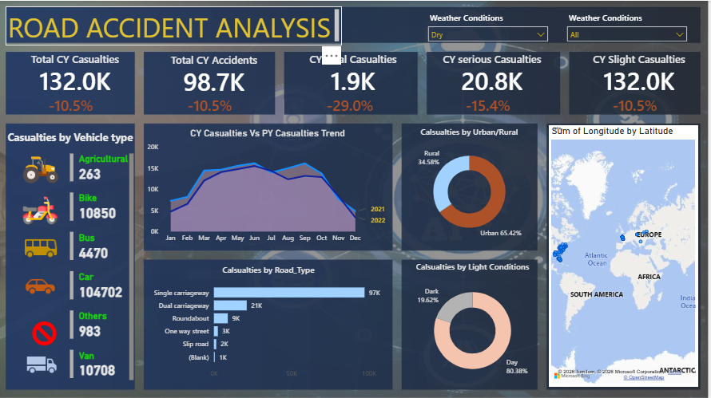

# Road Accident Analysis & Safety Intelligence Dashboard

**Power BI Business Intelligence Project | Road Safety & Accident Analytics**

---

## Business Problem and Context

Road traffic accidents generate large volumes of data covering casualties, accident severity, vehicle types, road characteristics, environmental conditions, and geographic locations. However, raw accident records provide limited value to decision-makers without structured analysis and visualization.

This project develops an interactive **Power BI Road Accident Analysis Dashboard** designed to transform accident records into actionable road-safety intelligence.

The dashboard enables users to evaluate:

* What is the overall volume of road accidents and casualties?
* How are casualty figures changing compared with the previous year?
* What proportion of casualties are fatal, serious, or slight?
* Which vehicle types contribute most significantly to casualties?
* How do casualties vary across different road types?
* Are accidents more prevalent in urban or rural environments?
* How do lighting conditions affect casualty distribution?
* How do casualty trends change throughout the year?
* Where are accident-related casualties geographically concentrated?
* How do weather conditions influence accident statistics?

The objective is to provide an interactive analytical environment that allows stakeholders to identify accident patterns, monitor changes over time, and support evidence-based road-safety decisions.

---

## Dashboard Preview and Interactive Features



#### Executive KPI Ribbon

The dashboard provides an immediate overview of the most important accident indicators:

* **Total Casualties**
* **Total Accidents**
* **Fatal Casualties**
* **Serious Casualties**
* **Slight Casualties**

Year-over-year percentage changes are displayed beneath the relevant KPIs to make performance movement immediately visible.

#### Interactive Filters

Users can dynamically filter the dashboard using:

* **Year**
* **Weather Conditions**

These slicers allow users to investigate accident patterns under different environmental conditions and reporting periods.

#### Casualties by Vehicle Type

A ranked breakdown shows casualties associated with different vehicle categories, including:

* Agricultural vehicles
* Bikes
* Buses
* Cars
* Other vehicles
* Vans

This visualization helps identify the vehicle groups most strongly associated with casualty volumes.

#### Casualty Trend Analysis

The monthly trend visualization compares casualty performance between the current and previous year.

This makes it possible to identify:

* Seasonal accident patterns
* Monthly peaks and declines
* Year-over-year changes
* Periods requiring additional road-safety attention

#### Urban vs Rural Analysis

A donut chart compares casualties occurring in:

* Urban areas
* Rural areas

This provides a high-level view of how accident casualties are distributed according to settlement and road environment.

#### Casualties by Road Type

The dashboard evaluates casualty volumes across different road classifications, including:

* Single carriageway
* Dual carriageway
* Roundabout
* One-way street
* Slip road
* Unknown / blank classifications

This allows stakeholders to identify road environments associated with higher casualty volumes.

#### Casualties by Light Conditions

Casualties are segmented according to:

* Daylight
* Darkness

The analysis provides additional context for evaluating accident exposure under different visibility conditions.

#### Geographic Analysis

A geographic map visualizes the spatial distribution of accident-related records, allowing users to identify areas with greater concentrations of road-safety incidents.

---

## Technical Architecture and Analytics Workflow

The project follows a structured Business Intelligence workflow:

```text
Raw Accident Data
        ↓
Data Cleaning & Transformation
        ↓
Data Modeling
        ↓
DAX Measures & Calculations
        ↓
Interactive Power BI Visualizations
        ↓
Executive Road Safety Dashboard
```

### 1. Data Ingestion

The accident dataset was imported into **Microsoft Power BI** for analysis.

The source data contains information relating to accident records, casualties, vehicles, road characteristics, environmental conditions, and geographic attributes.

### 2. Data Cleaning & Transformation

Power Query was used to prepare the dataset for analysis.

Key transformation activities included:

* Reviewing column data types
* Handling missing and blank values
* Standardizing categorical fields
* Preparing date-related fields
* Validating numerical measures
* Structuring accident and casualty attributes
* Preparing geographic fields for map visualization

### 3. Data Modeling

The cleaned data was structured into an analytical model suitable for interactive reporting.

The model supports analysis across dimensions such as:

* Time
* Vehicle type
* Road type
* Urban/Rural classification
* Light conditions
* Weather conditions
* Accident severity
* Geographic location

### 4. DAX Analytics

DAX measures were developed to calculate and monitor key performance indicators.

Examples of analytical measures include:

* Total Accidents
* Total Casualties
* Fatal Casualties
* Serious Casualties
* Slight Casualties
* Year-over-Year Change
* Current Year Performance
* Previous Year Performance

These measures provide the calculations powering the dashboard's KPI cards, trend analysis, and comparative visuals.

### 5. Dashboard Development

The final Power BI report was designed around an executive dashboard layout consisting of:

* KPI cards
* Interactive slicers
* Line charts
* Donut charts
* Bar charts
* Geographic maps
* Comparative year-over-year analysis

The visual hierarchy was designed to allow users to move from **high-level performance indicators to detailed accident patterns**.

---

## Executive Summary and Key Performance Indicators

| KPI                       | Purpose                                     | Business Significance                                                  |
| ------------------------- | ------------------------------------------- | ---------------------------------------------------------------------- |
| **Total Casualties**      | Measures the overall number of casualties   | Indicates the scale of road-safety impact                              |
| **Total Accidents**       | Measures the number of recorded accidents   | Provides an overview of accident frequency                             |
| **Fatal Casualties**      | Measures casualties resulting in fatalities | Critical indicator of road-safety severity                             |
| **Serious Casualties**    | Measures seriously injured casualties       | Highlights significant road-safety incidents                           |
| **Slight Casualties**     | Measures less severe casualties             | Provides a broader view of accident impact                             |
| **Year-over-Year Change** | Compares current and previous performance   | Identifies whether road-safety outcomes are improving or deteriorating |

---

## Core Analytical Insights

### 1. Cars Represent the Largest Casualty Category

The vehicle-type analysis shows that **cars account for the largest share of casualties** among the vehicle categories displayed on the dashboard.

This indicates that passenger vehicles should remain a major focus of road-safety interventions.

### 2. Significant Casualty Volume Occurs on Single Carriageways

The road-type analysis shows a substantial concentration of casualties on **single carriageways** compared with the other road classifications.

This suggests that single-carriageway environments warrant particular attention when evaluating road infrastructure and accident prevention strategies.

### 3. Urban Areas Account for a Larger Share of Casualties

The Urban/Rural visualization indicates a greater proportion of casualties occurring in **urban environments** than rural environments.

This highlights the importance of examining factors such as traffic density, pedestrian exposure, intersections, speed management, and road-user behavior in urban areas.

### 4. Daylight Accounts for the Majority of Casualties

The light-condition analysis shows that most casualties occur during **daylight conditions**.

This is an important analytical distinction: a higher number of daylight casualties does not necessarily imply that daylight is more dangerous. It may also reflect greater traffic exposure during daytime hours.

### 5. Casualties Vary Across the Year

The monthly trend analysis demonstrates noticeable variation in casualty volumes throughout the year.

Comparing the current and previous years provides an opportunity to identify:

* Seasonal patterns
* High-risk months
* Periods of improvement
* Periods where casualty volumes increase

### 6. Year-over-Year Performance Shows Overall Movement

The KPI cards provide direct comparison between the current and previous reporting periods, making it easier to identify whether key accident and casualty indicators are trending upward or downward.

---

## Strategic Recommendations

### Strengthen Road Safety Measures on High-Risk Road Types

Given the concentration of casualties on single carriageways, authorities should prioritize:

* Road infrastructure improvements
* Speed management
* Improved road markings
* Hazard identification
* Targeted enforcement

### Focus Vehicle Safety Campaigns on Cars

Because cars represent the largest casualty category, road-safety campaigns should emphasize:

* Speed compliance
* Seat-belt usage
* Distracted-driving prevention
* Responsible driving behavior
* Driver awareness

### Improve Urban Road Safety

The higher urban casualty concentration supports targeted interventions such as:

* Safer pedestrian crossings
* Traffic-calming measures
* Improved junction design
* Better traffic management
* Enhanced road-user education

### Investigate Seasonal Accident Patterns

High-casualty periods identified through the monthly trend analysis can be used to support:

* Seasonal enforcement campaigns
* Public awareness programs
* Emergency response planning
* Traffic management initiatives

### Integrate Weather and Environmental Analysis

The interactive weather filter provides an opportunity to investigate accident patterns under different environmental conditions.

This analysis can support recommendations around:

* Driver warnings
* Reduced-speed campaigns
* Visibility awareness
* Road-condition monitoring
* Emergency preparedness

### Use Geographic Intelligence for Resource Allocation

The geographic visualization can help identify areas with higher accident concentrations.

Road-safety resources can then be prioritized toward locations demonstrating consistently high accident or casualty levels.

---

## Power BI Skills Demonstrated

This project demonstrates practical experience in:

* **Power BI Desktop**
* **Power Query**
* **DAX**
* **Data Cleaning**
* **Data Transformation**
* **Data Modeling**
* **KPI Development**
* **Time-Series Analysis**
* **Year-over-Year Analysis**
* **Interactive Slicers**
* **Geographic Data Visualization**
* **Dashboard Design**
* **Business Intelligence Reporting**
* **Data Storytelling**

---

## Repository Structure

```text
road-accident-analysis-powerbi/
│
├── README.md
│
├── assets/
│   └── road-accident-dashboard.png
│
├── dataset/
│   └── road-accident-dataset.xlsx
│
└── powerbi/
    └── Road Accident Analysis.pbix
```

### Repository Contents

| Directory / File | Description                                   |
| ---------------- | --------------------------------------------- |
| `README.md`      | Project documentation and analytical overview |
| `assets/`        | Dashboard screenshots and supporting visuals  |
| `dataset/`       | Source accident dataset                       |
| `powerbi/`       | Interactive Power BI report                   |

---

## How to Access and Reproduce

### 1. Clone the Repository

```bash
git clone https://github.com/YOUR-USERNAME/road-accident-analysis-powerbi.git
```

### 2. Open the Power BI Report

Open:

```text
powerbi/Road Accident Analysis.pbix
```

using **Microsoft Power BI Desktop**.

### 3. Load the Dataset

If the data source path needs to be updated:

1. Open the Power BI report.
2. Select **Transform Data**.
3. Open **Data Source Settings**.
4. Update the dataset location.
5. Apply the changes.
6. Refresh the report.

### 4. Explore the Dashboard

Use the available slicers and visual interactions to analyze accident and casualty performance across:

* Years
* Weather conditions
* Vehicle types
* Road types
* Urban/Rural environments
* Light conditions
* Geographic locations

---

## Project Outcome

The project transforms raw road accident records into an interactive **Road Safety Business Intelligence Dashboard**.

Instead of relying on static tables, decision-makers can interactively explore accident volumes, casualty severity, vehicle involvement, road characteristics, environmental conditions, temporal trends, and geographic distribution.

The resulting dashboard demonstrates how **Power BI, Power Query, DAX, and data visualization can convert operational accident data into actionable road-safety intelligence.**

---

## Future Enhancements

Potential extensions to the project include:

* Accident severity prediction using machine learning
* Weather-specific accident risk scoring
* Interactive accident hotspot detection
* More detailed geographic drill-down
* Accident rate normalization using population or traffic exposure
* Forecasting future casualty volumes
* Integration with live road and weather data
* Automated Power BI Service refresh
* Executive-level drill-through reporting

---

## License

This project is intended for educational, portfolio, and analytical demonstration purposes.

If the underlying dataset has its own licensing or attribution requirements, those requirements should be retained and acknowledged in this repository.
